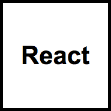

  

React in a Box is an isomporhic React boilerplate utilizing a Node/Express server, Redux, React Router v4 and Webpack.

## Installation

    > Fork this repo
    > git clone https://github.com/<Your URL>/react-in-a-box.git <Your App Name>
    > cd <Your App Name>
    > yarn install
    
## Run Application

#### Start Isomorphic Application

    > yarn run start
    
#### Start Development Environment

    > yarn run dev

## Webpack

#### Build client

    > yarn run build:client
    
#### Build server

    > yarn run build:server

There is currently no production build for Webpack. It is empty for you to setup based on your needs.

## Testing

#### Run tests with Jest

    > yarn run test:jest
    
#### Run tests with Mocha

    > yarn run test:mocha
